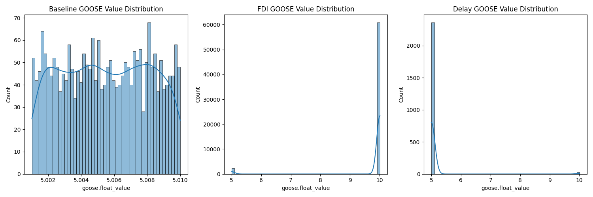
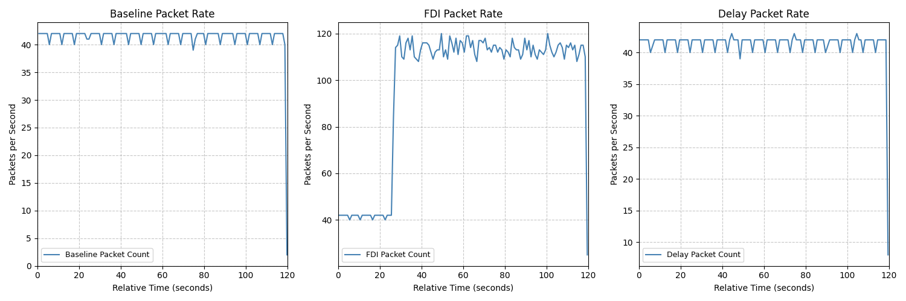
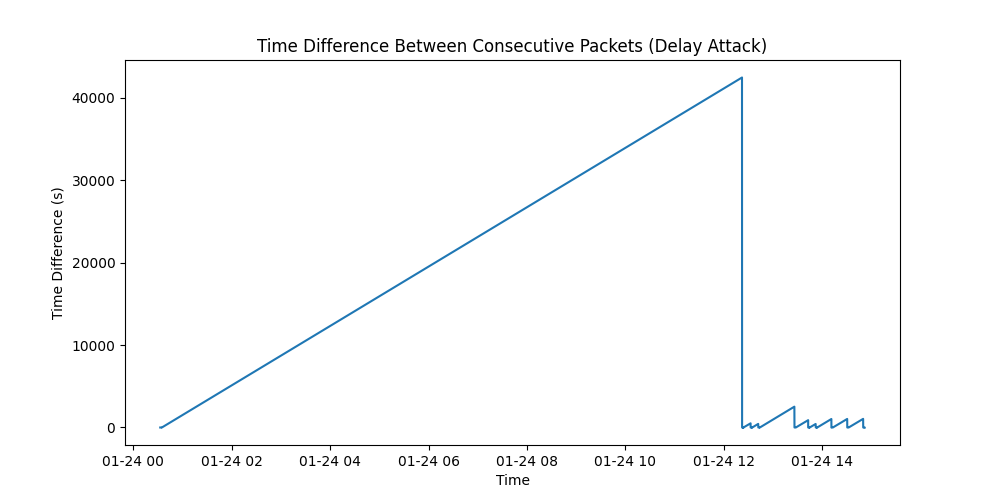
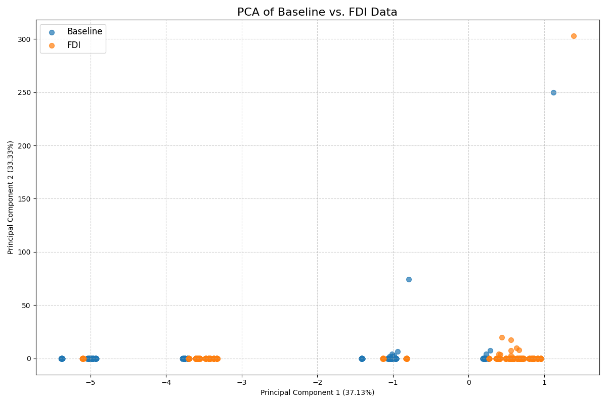

Summary of the findings based on three CSV files: C0_Baseline.csv, C1_FDI.csv, and C2_Delay.csv.

Analysis of the CSV files

### 1. GOOSE Value Distribution:

*   **Baseline:** The `goose.float_value` is concentrated around a few specific values, which represents the normal behavior of the system.
*   **FDI:** The distribution of `goose.float_value` is much wider and has multiple peaks. This clearly shows the injection of false data by the attacker.
*   **Delay:** The distribution is similar to the baseline, which is expected as the delay attack does not manipulate the data itself.

**2. Packet Frequency:**

*   **Baseline:** The packet frequency is relatively stable, with some minor fluctuations, representing the normal traffic of the system.
*   **FDI:** There is a huge spike in the number of packets per second. This confirms that the FDI attack is also a packet flood attack, where the attacker is sending a large number of packets to the system.
*   **Delay:** The packet frequency is similar to the baseline.

**3. Delay Analysis:**

*   This plot clearly shows spikes of approximately 30 seconds in the time difference between consecutive packets in the `C2_Delay.csv` dataset. This confirms the 30-second delay attack.

### Conclusion

The analysis of the three CSV files has successfully identified the characteristics of the False Data Injection (FDI) and the 30-second delay attacks.

*   The **FDI attack** is characterized by the injection of false `goose.float_value` data and a significant increase in packet frequency (packet flood).
*   The **30-second delay attack** is characterized by a significant delay in the transmission of packets, which is visible as spikes in the time difference between consecutive packets.

I can now proceed with more in-depth statistical analysis and hypothesis testing to further quantify the impact of these attacks. For example, I can:

*   Calculate the statistical significance of the difference in means of `goose.float_value` between the baseline and FDI datasets.
*   Perform a time-series analysis to model the behavior of the system under normal and attack conditions.
*   Investigate the source of the FDI attack by analyzing the `eth.src` MAC addresses.

* Type of Plot: It's a scatter plot, a common visualization used in Principal Component Analysis (PCA).
* Axes:
    * X-axis (Horizontal): Represents the first Principal Component (PC1). This component captures the largest amount of variance in your dataset.
    * Y-axis (Vertical): Represents the second Principal Component (PC2). This component captures the second largest amount of variance, orthogonal to PC1.
    * The labels on the axes also indicate the percentage of total variance explained by each respective principal component (e.g., "Principal Component 1 (XX.XX%)").
* Data Points: Each point on the plot corresponds to an individual data entry (likely a network packet or a record) from your combined dataset.
* Color-Coding: The points are colored differently based on their origin:
    * One color (e.g., blue) for 'Baseline' data.
    * Another color (e.g., orange) for 'FDI' (Fault Data Injection) data.
* Purpose: The primary goal of this plot is to visualize how well the "baseline" (normal network traffic) and "fdi" (fault-injected traffic) data points separate in a reduced
  2-dimensional space.
    * If the 'Baseline' and 'FDI' clusters are well-separated, it suggests that the FDI attack significantly changes the data patterns, making it easier to detect.
    * If the clusters overlap heavily, it indicates that the FDI attack might not be easily distinguishable from normal traffic using just these two principal components.

 In summary, pca_2d_plot.png provides a visual representation of the inherent differences or similarities between normal and fault-injected network traffic by projecting high-dimensional
 data onto the two most significant principal components. The script also prints the "Explained variance ratio" for each principal component and the "Feature loadings," which tell you   
 which original features contribute most to each principal component.